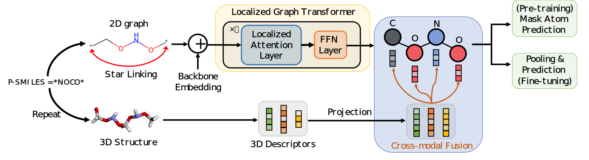

# MIPS: a Multimodal Infinite Polymer Sequence Pre-training Framework for Polymer Property Prediction



MIPS is built upon **VeMoL (Versatile Molecular representation Learning)** (unpublished)       

Install VeMoL:     
```bash
pip install -e .
```

Install PyTorch and DGL      

Different polymer modeling approaches: star link, star keep and star remove are in *vemol/chem_utils/polymer_utils.py*       

Pre-train
```bash
HYDRA_FULL_ERROR=1 CUDA_VISIBLE_DEVICES=0 vemol-train --config-name mae_pretrain name=pl1m_star_link_gt6_hidden512_seed1 checkpoint.save_step=True checkpoint.save_epoch=False checkpoint.save_step_interval=2000 common.max_steps=20000 common.seed=1 dataset.mol_graph_collator_cfg.downsize=-1 dataset.batch_size=1024 model=kfuse_graph_transformer model.d_model=512 model.num_layers=6 scheduler.warmup_steps=2000 scheduler.lr=2e-4 dataset.use_cache_data=True dataset.completion=True dataset.name=pl1m_aug dataset/mol_graph_form_cfg=polymer_atom_graph dataset.mol_graph_form_cfg.op=star_link dataset.mol_graph_collator_cfg.lmdb_path=data/pl1m_aug_pretrain_atom_graphs/lmdb dataset.kvec_names=[md,atom_pair_3d]
```

Finetune:  
```bash
HYDRA_FULL_ERROR=1 CUDA_VISIBLE_DEVICES=1 python scripts/finetune.py --seed=1 --lr=1e-4 --op=star_link --kvec_names=[md,atom_pair_3d] --model_path=checkpoint/mae_pretrain/ckpt.pth
```